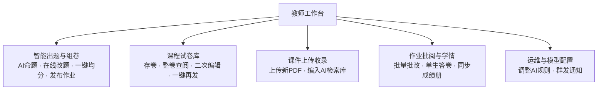
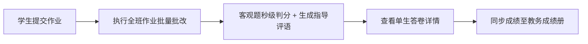

# 《电力系统储能技术》课程平台教师使用指南

> 适用版本：2026-09-07 更新（含对话助教可靠性升级与成绩册同步修复）
> 支持邮箱：`registrar_off@qq.com`

欢迎各位授课教师使用《电力系统储能技术》课程教学平台。本指南面向非计算机专业的任课教师，全部使用日常教学语言，不涉及计算机技术术语。

通过本平台，教师可以完成以下工作：

| 教学环节 | 平台能力 |
| :--- | :--- |
| 备课 | AI 助教答疑验证、课件秒级阅读、知识图谱串讲与自定义编辑 |
| 出题 | 按章节与难度 AI 生成试题、在线改题改答案、一键平分满分 100 分 |
| 布置作业 | 一键发布至全班任务中心，自动发布置顶通知，试卷可入库复用 |
| 批改 | 客观题全班秒级批改、单生答卷复核、一键同步 Moodle 教务成绩册 |
| 学情 | 班级掌握度看板、薄弱考点预警（低于 60% 自动提取）、单生成绩查询 |
| 课堂互动 | 随堂单题快测、连续学情诊断、电站运维师傅情景演练 |

---

## 目录

1. [五分钟快速上手](#1-五分钟快速上手)
2. [登录平台](#2-登录平台)
3. [教师工作台总览](#3-教师工作台总览)
4. [AI 智能出题与组卷](#4-ai-智能出题与组卷)
5. [修改题目、答案与分值](#5-修改题目答案与分值)
6. [预览试卷并发布作业](#6-预览试卷并发布作业)
7. [试卷库：保存与复用](#7-试卷库保存与复用)
8. [课件上传与高清阅读](#8-课件上传与高清阅读)
9. [批改作业并同步教务成绩册](#9-批改作业并同步教务成绩册)
10. [班级学情与单个学生成绩查询](#10-班级学情与单个学生成绩查询)
11. [课程助教：备课与课堂互动](#11-课程助教备课与课堂互动)
12. [知识思维导图的使用与自定义编辑](#12-知识思维导图的使用与自定义编辑)
13. [发布通知与全班提醒](#13-发布通知与全班提醒)
14. [平台可靠性说明：哪些提示是正常的](#14-平台可靠性说明哪些提示是正常的)
15. [常见问题解答（FAQ）](#15-常见问题解答faq)

---

## 1. 五分钟快速上手

第一次使用，只需要走完下面四步：

1. 浏览器打开 `https://energygraph.icu/agent/`，用教师账号登录（见第 2 节）；
2. 点击左侧菜单 **“教师工作台”**，在 **“智能出题与组卷”** 面板选好章节和难度，点击 **`AI 自动出题`**，几秒钟得到一份带答案和解析的试卷初稿；
3. 在线检查并修改题目，点击 **`一键平分满分100分`**，再点击 **`确认发布作业至全班`**——作业会立刻出现在全班学生的“任务中心”，并自动发布置顶通知；
4. 学生提交后，进入 **“作业批阅与学情”** 面板点击批量批改，最后点击 **同步成绩** 把成绩写入教务成绩册。

其余功能（课件、图谱、学情、AI 助教）可以在日常教学中逐步熟悉。

---

## 2. 登录平台

### 2.1 访问地址

- 平台主入口：`https://energygraph.icu`
- 课程工作空间：`https://energygraph.icu/agent/`

### 2.2 推荐浏览器

- 谷歌浏览器（Chrome，推荐）
- 微软 Edge
- 苹果 Safari
- 国产浏览器请切换到“极速模式”

### 2.3 教师账号

- 用户名：`teacher`
- 密码：`Moodle2026!`（首字母 M 大写，结尾为半角感叹号）

登录后右上角应显示您的姓名与“教师”身份标识。如需修改密码或新增教师账号，请联系管理员。

---

## 3. 教师工作台总览

登录后点击左侧菜单 **“教师工作台”**，顶部共五个功能面板：

---

## 4. AI 智能出题与组卷

### 4.1 操作步骤

1. 进入 **“教师工作台”**，默认停留在 **“智能出题与组卷”** 面板；
2. 在左侧参数区依次选择：

| 参数 | 可选项 | 说明 |
| :--- | :--- | :--- |
| 章节范围 | 第 1～6 章 | 单章考查或跨章综合 |
| 试卷难度 | 基础认知 / 进阶应用 / 综合分析 | 分别对应预习检测、随堂测验、阶段大作业 |
| 题目数量 | 1 / 3 / 5 题 | |
| 题目类型 | 单选题 / 多选题 / 综合判断题 | |
| 作业标签 | 阶段测验 / 课程作业 / 随堂自测 / 大作业 | |
| 作业标题 | 自动生成，可修改 | |
| 截止日期 | 学生最晚交卷时间 | |

3. 点击绿色 **`AI 自动出题`** 按钮；
4. 稍候数秒，右侧编辑区展示整套试题初稿。

### 4.2 生成的题目包含什么

每道题都包含完整教学要素：专业题干、四个选项、**标准答案**、名师深度解析、**课件出处页码**（如“3.4 储能变流器拓扑及并网控制.pdf 第 12 页”），点击页码可直接调出对应课件页面核对。

> 说明：平台保证“答案与题目严格对应”——每道题交付前系统都会核验标准答案的存在与合法性；个别时候 AI 服务波动导致题目不合格，系统会自动重试，重试仍失败会明确提示“暂时不可用”，**绝不会用编造的题目或答案充数**（详见第 14 节）。

---

## 5. 修改题目、答案与分值

AI 生成的内容只是初稿，教师拥有 100% 的终审权：

- **改题干 / 选项 / 解析**：直接点击对应输入框修改；
- **改标准答案**：点击选项前的圆圈即可指定；
- **改单题分值**：在题目卡片右上角分数框直接输入；
- **一键平分满分 100 分**：点击试卷上方按钮，系统自动均分并凑整，保证总分恰好 100 分；
- **删题 / 加题**：题目卡片右上角 `删除本题`；底部 `+ 继续添加一道题目` 可手动补题。

---

## 6. 预览试卷并发布作业

### 6.1 发布前预览

点击 **`预览试卷`** 可弹出与学生端完全一致的答题卡窗口，逐题检查排版、选项与解析后关闭即可。

### 6.2 正式发布

确认无误后点击 **`确认发布作业至全班`**，系统自动完成两件事：

1. **推送学生端**：全班选课学生的“任务中心”立刻出现该作业，标记为“待完成”；
2. **自动置顶公告**：“通知与讨论”板块自动发布《新作业发布通知》，包含作业名、总分、题量与截止时间。

---

## 7. 试卷库：保存与复用

组好一套高质量试卷后，点击 **`保存为试卷组`** 存入试卷库。在 **“课程试卷库”** 面板中可以：

- **查看试卷**：全屏预览整卷题目、答案与解析；
- **载入出题台**：调回出题工作台二次编辑；
- **一键发布**：新学期直接下发给新班级，无需重复出题；
- **删除**：清理废弃试卷。

---

## 8. 课件上传与高清阅读

### 8.1 上传新课件

1. 进入 **“教师工作台” -> “课件上传收录”**；
2. 选择所属章节，拖入 PDF 文件；
3. 点击 **`上传并收录入资源包`**。

上传后新课件同时进入学生“课程资源”列表与 AI 助教检索库，学生提问时 AI 会自动引用新课件内容。

### 8.2 高清阅读

左侧菜单 **“课程资源”** 打开任意课件：打开速度秒级；左侧缩略图即点即切；阅读器内选中文字可直接向 AI 助教发起针对提问。

---

## 9. 批改作业并同步教务成绩册

### 9.1 提交概况

进入 **“作业批阅与学情”** 面板，顶部实时显示：全班提交人数、待批改人数、全班平均分、批阅完成率。

### 9.2 批量批改

点击 **`执行全班作业批量批改`**：系统自动比对标准答案完成全部客观题判分，并生成针对性评语。

### 9.3 单生答卷复核

在提交列表点击该生的 **`查看答卷`**：成绩横幅、逐题选项对比（标准答案绿底、学生选择对绿底/错红底）、失分归因解析，并可点击 **`查阅关联讲义`** 直达课件对应页。

### 9.4 同步教务成绩册

批改完成后点击 **同步成绩**，成绩即写入 Moodle 教务成绩册。同步成功与否页面会明确反馈；若提示同步失败，稍后重试即可，学生的本地成绩记录不会丢失。

---

## 10. 班级学情与单个学生成绩查询

### 10.1 班级学情大盘

左侧菜单 **“班级学情与成绩”** 顶部为四大核心指标，鼠标悬停问号可查看透明计算规则：

| 指标 | 计算规则 |
| :--- | :--- |
| 全班平均成绩 | 已批改作业得分总和 / 已批改份数（附及格率） |
| 作业提交总览 | 累计提交人次 / 累计应交人次（区分班级整体进度与单作业按时状态） |
| 需关注考点 | 班级平均掌握度低于 60% 且错题集中的考点，自动提取 |
| 班级学情指数 | 提交进度 30% + 测验均分 50% + 课件学习进度 20% |

### 10.2 单个学生查询

在成绩花名册中可按分数段筛选（优秀 ≥ 90、良好 75～89、需关注 < 75），或按姓名、学号搜索；点击记录可调阅该生历次答卷与错题清单。

---

## 11. 课程助教：备课与课堂互动

点击左侧菜单 **“课程助教”** 进入对话界面。所有回答均要求附课件页码溯源，可直接点击页码标签调出课件。

### 11.1 备课答疑

直接输入问题（如“下垂控制的数学推导”），AI 输出 LaTeX 公式排版与工程案例，可复制进教案。

### 11.2 两种提问的快捷方式

- **图谱考点直达**：在 **“思维导图”** 中点击任意考点，选择“向课程助教提问”，即围绕该考点发起深度长对话；
- **划词追问**：在课件阅读器或对话中选中一段文字，点击“追问”，AI 只针对这段内容精讲。

### 11.3 随堂单题快测（单题模式）

点击对话区下方 **`[ 随堂单题精练 ]`**，AI 针对当前知识点即时出一道单选题并挂出 A/B/C/D 选项卡；作答后立即判定正误、给出解析与课件定位。适合课堂即讲即测。输入“停止出题”可随时结束。

### 11.4 互动学情诊断（连续测评模式）

点击 **`[ 综合学情体检 ]`** 或输入“进行学情诊断”，AI 连续出跨章节自适应题目，每题作答后即时点评；随时可输入“生成诊断报告”提前结束并产出多维度学情报告（含掌握度评级、薄弱点归因、靶向复习路径与课件直达链接）。

> 实用提示：测评途中若某道题生成失败，系统会如实提示并保留已有作答记录，此时回复 **“下一题”** 即可补发新题继续测评，无需重新开始。

### 11.5 情景演练（角色扮演）

点击 **`[ 师傅情景演练 ]`** 或 **`[ 名师情景演练 ]`**，AI 分别扮演储能电站现场运维师傅或课程主讲教师，可模拟电池簇过温告警、变流器故障排查等工程互动，作为课堂实操素材。输入“退出情景演绎”即可随时结束。

### 11.6 在线调整 AI 的说话与出题规则

进入 **“教师工作台” -> “运维与模型配置”**，在“AI 说话与出题要求设置”区：

- 切换到 **`教师备课工作要求`** 选项卡，直接输入要求（例如“生成题目必须结合 GB/T 36547 国家标准”）；
- 点击 **`保存规则配置`** 立即生效；
- 效果不理想可点击 **`恢复默认规则`** 一键还原。

---

## 12. 知识思维导图的使用与自定义编辑

### 12.1 基本操作

| 操作 | 方式 |
| :--- | :--- |
| 移动画布 | 按住空白处拖拽 |
| 缩放 | 鼠标滚轮 |
| 一键居中 | 左上角 `居中视野` |
| 切换视角 | 顶部下拉：全景 / 第 1～6 章独立视角 |

### 12.2 浏览模式（课堂默认）

- 单击节点：右侧抽屉展示考点提要、前置基础、进阶方向与拓扑关联；
- 双击节点或点击抽屉内 **`打开对应PPT课件 (第 X 页)`**：秒级调出课件并定位页码，适合随堂串讲；
- 编辑工具全部隐藏，键盘删除键被拦截，课堂演示不会误改图谱。

### 12.3 编辑模式

点击右上角绿色 **`[ 修改图谱 ]`** 进入编辑态：

- **新增子考点 / 同级考点**：选中节点后点击顶部工具栏对应按钮；
- **删除节点**：选中后点击 `删除节点` 并确认（课程根节点与 6 个章节主干受保护，误删会被拦截提示）；
- **编辑考点属性**：在右侧抽屉点击 `[ 编辑此节点信息与PPT关联 ]`，可设置考点名称、提要、关联课件与页码，保存后节点亮起 `PPT P.14` 式绿色徽标，点击直达课件；
- **建立先修连线**：选中起点考点 → 点击 `建立关联连线` → 点击目标考点 → 输入关系名（如“机理定容”）→ 确认后生成橙色虚线先修关系线；可在抽屉中随时 `[解除]`。

### 12.4 保存与恢复

- **保存图谱修改**：一键存入云端，换电脑、换浏览器自动同步；
- **恢复默认图谱**：连线混乱时一键还原出厂标准图谱；
- **导出 JSON**：下载 `energygraph-mindmap-data.json`，可用于教研分享。

---

## 13. 发布通知与全班提醒

两种方式：

1. **讨论区公告**：左侧 **“通知与讨论”** → `发布新主题` → 选择公告标签、填写标题正文发布；
2. **一键催交提醒**：**“教师工作台” -> “运维与模型配置”** → 点击 **`发布系统通知`**，向全体选课学生推送作业截止置顶提醒。

---

## 14. 平台可靠性说明：哪些提示是正常的

平台执行一条严格原则：**宁可如实告知，绝不编造内容**。因此您或学生可能偶尔看到以下提示，它们都是系统的正常保护行为，不是故障报警：

| 提示 | 含义 | 建议做法 |
| :--- | :--- | :--- |
| “出题大模型服务本次未返回有效题目（已自动重试一次）” | AI 服务瞬时波动，系统重试后仍不合格，拒绝以次充好 | 稍候重试即可；诊断模式下回复“下一题”可直接补题 |
| “这道题没有携带可核验的标准答案，已停止判分” | 个别题目答案数据异常，系统拒绝胡乱判分 | 回复“下一题”换题；随堂模式回复“出题”重新开始 |
| “情景演绎暂时不可用” | 角色扮演服务瞬时波动 | 稍后重新开启即可 |
| “课程助教服务暂时无法连接，本次没有生成任何回答” | 网络异常时平台拒绝离线编造答案 | 检查网络后重新提问 |

同时，平台设有内容边界：要求 AI 编造实验数据、文献或绕过课程知识库的请求会被直接拒绝。这是教学严谨性的设计，不是故障。

---

## 15. 常见问题解答（FAQ）

### Q1：AI 出的题会不会超出教学大纲？

不会。出题深度绑定课程 20 份官方课件知识库，考点、公式与案例严格限制在课程范围内，并自动标注课件出处页码，可点击核对。

### Q2：作业截止时间到了还能改吗？

可以，进入工作台随时调整作业截止时间。

### Q3：发现某题标准答案设错了怎么办？

出题界面点击选项前圆圈即可更改；作业已发布的，修改后重新批改，系统按新答案重算全班分数。

### Q4：客观题判分规则是什么？

学生所选选项与标准答案一致即得该题满分；多选题漏选按 50% 计分。主观题由 AI 初评、教师复核后生效。

### Q5：换电脑或浏览器后，我改过的思维导图还在吗？

在。图谱保存后持久化存储在云端服务器，任何设备登录教师账号都会自动同步最新版本；需要恢复原貌时点击“恢复默认图谱”即可。

### Q6：学生在 AI 对话里刷题，会不会重复遇到做过的题？

平台对同一会话内的题目做了去重保护：AI 出现与已出题目重复的情况会被自动拦截并换题。跨天新开会话后题目池会重新开始。

### Q7：学生反馈某次诊断“卡住”了怎么办？

让该生在对话框回复“下一题”即可补发新题；如需提前结束，回复“生成诊断报告”，已作答题目的成绩与记录完好无损。

### Q8：成绩同步教务册失败了怎么办？

直接重试同步即可，学生已批改的成绩在平台内不会丢失；若多次失败请联系技术支持。

### Q9：遇到其他问题如何联系技术团队？

发送邮件至 `registrar_off@qq.com`，技术团队将在 24 小时内协助处理。
