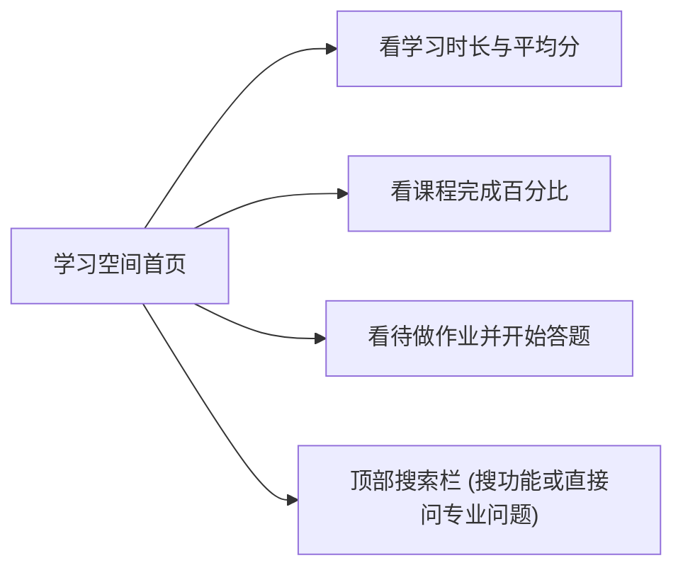
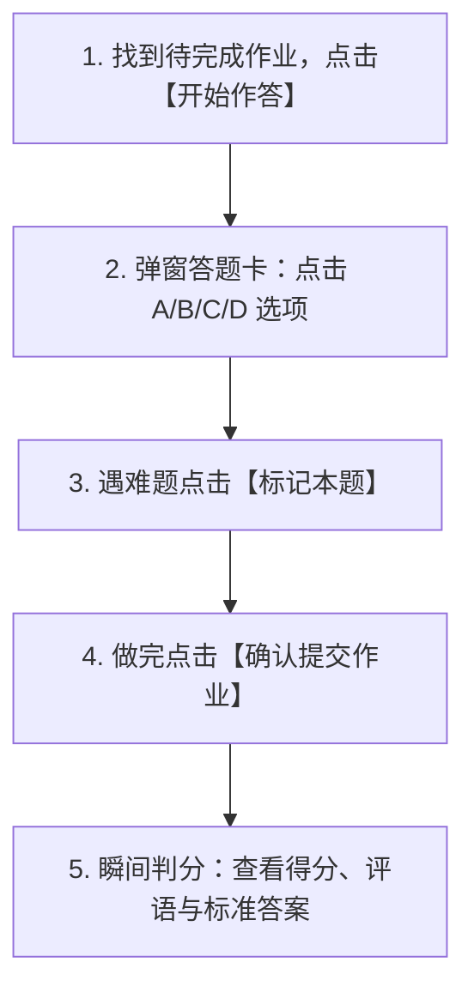

# 《电力系统储能技术》课程平台学生使用指南

欢迎各位同学使用《电力系统储能技术》课程智能学习平台。本指南专为选课同学编写，用最通俗易懂的大白话讲解网站的所有功能，没有复杂的计算机技术术语。

通过本平台，同学们可以轻松实现：
- **随时随地看课件**：整门课 6 大章节、20 份完整高清讲义在线直接翻看，不用提前下载大文件；
- **在线做作业与秒获成绩**：做完作业点击交卷，系统瞬间自动判分，并马上给出标准答案与详细的名师解析；
- **智能错题本与一键查课件**：做错的题目自动归档，点击“查阅关联讲义”按钮能瞬间翻到课件对应那一页；
- **向 AI 助教一键追问**：点击“向助教一键追问”按钮，不用打字就能让 24 小时在线的 AI 老师详细给你讲题；
- **全景思维导图与电站实战演练**：用连线图看清知识先后顺序，还能让 AI 扮演电站带班师傅带你排查真实设备故障。

---

## 目录

1. [如何登录与注册账号](#1-如何登录与注册账号)
   - [1.1 平台访问地址与推荐浏览器](#11-平台访问地址与推荐浏览器)
   - [1.2 学生通用教学账号（免注册直接登录）](#12-学生通用教学账号免注册直接登录)
   - [1.3 自己注册新账号（注册即可登录，免等邮件）](#13-自己注册新账号注册即可登录免等邮件)
2. [学习空间首页：查看学习进度与待做作业](#2-学习空间首页查看学习进度与待做作业)
3. [课程资源：在线看 20 份高清课件与下载讲义](#3-课程资源在线看-20-份高清课件与下载讲义)
4. [任务中心：怎么做作业、交卷与得分规则](#4-任务中心怎么做作业交卷与得分规则)
5. [个人成绩单：右上角小问号查看各项分数是怎么算出来的](#5-个人成绩单右上角小问号查看各项分数是怎么算出来的)
6. [智能错题本与做题复盘（核心推荐）](#6-智能错题本与做题复盘核心推荐)
   - [6.1 怎么只看自己的错题与待巩固题目？](#61-怎么只看自己的错题与待巩固题目)
   - [6.2 选项上的“您的选择”与“标准答案”怎么看？](#62-选项上的您的选择与标准答案怎么看)
   - [6.3 “查阅关联讲义”按钮：点一下直接翻到课件那一页](#63-查阅关联讲义按钮点一下直接翻到课件那一页)
   - [6.4 “向助教一键追问”按钮：点一下让 AI 老师详细讲错因](#64-向助教一键追问按钮点一下让-ai-老师详细讲错因)
7. [课程思维导图：用连线图看清各个知识点的先后顺序](#7-课程思维导图用连线图看清各个知识点的先后顺序)
8. [24小时 AI 课程助教：随时答疑的 5 种好用方法](#8-24小时-ai-课程助教随时答疑的-5-种好用方法)
   - [用法一：直接打字提问（公式排版工整，还能定位课件页码）](#用法一直接打字提问公式排版工整还能定位课件页码)
   - [用法二：互动学情诊断（连续做 3 题，AI 给你出一份体检报告）](#用法二互动学情诊断连续做-3-题ai-给你出一份体检报告)
   - [用法三：随堂考点自测（让 AI 出一道单选题考考你）](#用法三随堂考点自测让-ai-出一道单选题考考你)
   - [用法四：电站现场演练（AI 扮演电站老师傅，带你排查故障）](#用法四电站现场演练ai-扮演电站老师傅带你排查故障)
   - [用法五：划词追问（哪句话看不懂，鼠标一划就能追问推导）](#用法五划词追问哪句话看不懂鼠标一划就能追问推导)
9. [班级通知与提问讨论区](#9-班级通知与提问讨论区)
10. [学生常见问题解答 (FAQ)](#10-学生常见问题解答-faq)

---

## 1. 如何登录与注册账号

### 1.1 平台访问地址与推荐浏览器
在电脑、平板或手机浏览器中输入以下地址即可进入平台：
- **网址**：`https://energygraph.icu` 或 `https://energygraph.icu/agent/`
- **推荐浏览器**：谷歌浏览器（Chrome）、微软 Edge 浏览器、苹果 Safari 浏览器、360/QQ浏览器（极速模式）。

### 1.2 学生通用教学账号（免注册直接登录）
如果想直接使用平台统一配置的教学账号，可以直接输入以下学生账号密码登录：
- **用户名**：`student`
- **密　码**：`Moodle2026!`（注意：首字母 M 为大写，末尾带半角感叹号）

### 1.3 自己注册新账号（注册即可登录，免等邮件）
如果您希望使用属于自己的实名账号记录学习轨迹：
1. 打开注册页面：`https://energygraph.icu/login/signup.php`；
2. 填写 **用户名**（建议使用真实学号）、**密码**（需包含大小写字母和数字，例如 `Abc123456.`）、**常用邮箱** 和 **真实姓名**；
3. 点击底部的 **“创建新账号”** 按钮；
4. **无需去邮箱找激活邮件**：系统后台已开启全自动激活服务，在您点击创建的瞬间，账号就已经激活并自动加入了《电力系统储能技术》课程空间。返回登录页面直接输入账号密码即可登录。

---

## 2. 学习空间首页：查看学习进度与待做作业

登录成功后，默认进入“学习空间”首页：

- **顶部统计看板**：清晰展示您在这门课上累计学习了多少小时、完成了几次作业、测验平均成绩是多少；
- **课程进度圆环**：直观显示整门课程您当前已经完成了百分之多少；
- **待做任务列表**：列出老师近期发布的作业和随堂测验，标明了最晚截止时间，点击右侧的“开始作答”即可进入答题；
- **顶部全局搜索栏**：
  - 如果输入“作业”、“课件”、“错题”等功能词按回车，页面会自动跳转到对应板块；
  - 如果输入具体的储能专业疑问（比如“为什么构网型变流器在弱电网下更稳定？”）按回车，系统会直接调出 AI 助教为您展开解答。

---

## 3. 课程资源：在线看 20 份高清课件与下载讲义

点击左侧菜单栏的 **“课程资源”**：
1. 页面按照第 1 章（概述）至第 6 章（性能检测与评估）整理好了全部 20 份官方高清 PDF 课件；
2. **免下载在线看**：点击任意课件标题，就能在网页里全屏阅读 PPT 讲义，支持鼠标滚轮翻页、放大缩小和上一页/下一页切换，打开速度非常快；
3. **本地下载**：如果需要离线复习，点击阅读器右上角的下载按钮，即可将 PDF 讲义保存到本地电脑或平板中。

---

## 4. 任务中心：怎么做作业、交卷与得分规则

点击左侧菜单栏的 **“任务中心”**：

### 4.1 做题步骤
1. 在任务列表中找到状态为 **“待完成”** 的作业，点击右边的 **`开始作答`** 按钮；
2. 页面会弹出一个答题卡窗口：
   - 顶部有一排题号按钮，点击可自由切换题目；
   - 直接点击 A、B、C、D 选项卡作答，选中的选项会高亮显示；
   - 遇到拿不准的题目，点击底部的 **`标记本题`**，题号右上角会亮起黄色小标记，提醒自己交卷前再检查一遍；
3. 做完所有题目后，点击底部的 **`确认提交作业`** 按钮；
4. 系统会在 0.1 秒内自动完成判分，并立即弹窗显示您的实得分数、得分率以及老师评语。

### 4.2 客观题判分规则（完全公开透明）
- **单选题**：只要选对了，即获得该题 100% 满分（例如 33 分的题直接得 33 分）；选错得 0 分；
- **多选题**：全部选项选对得 100% 满分；漏选（所选全部正确但未选全）获得 50% 折扣分；选错任意一个错误选项得 0 分。

---

## 5. 个人成绩单：右上角小问号查看各项分数是怎么算出来的

点击左侧菜单栏的 **“班级学情与成绩”**，在学生视角下就是您的个人成绩单。

顶部有四个大指标卡片。如果您想知道某个分数是怎么计算出来的，**只要把鼠标移动到卡片右上角的小问号 `?` 上**，就会弹出一个清晰的小浮层为您解释：

1. **平均成绩**（右上角 `?`）：
   - **计算公式**：`已批改实得分 ÷ 批改题目满分 × 100%`
   - **说明**：只统计您已经做完并批改的作业得分率。还没有开始做的作业**绝对不会**拉低您的平均分。
2. **已提交作业**（右上角 `?`）：
   - **计算公式**：`已完成提交作业数 ÷ 课程总作业数 × 100%`
   - **说明**：直观展示您的作业完成进度（例如 `2 / 6 份 (33%)`）。
3. **薄弱考点**（右上角 `?`）：
   - **评定标准**：某一章节或考点综合正确率低于 60% 判定为薄弱点（达到 85% 以上即为熟练掌握）；
   - **说明**：精准提醒您哪一部分知识容易失分，帮助您查漏补缺。
4. **学情健康度**（右上角 `?`）：
   - **计算公式**：`平均成绩 × 50% + 提交率 × 30% + 考点达标率 × 20%`
   - **评级标准**：$\ge 90$ 分（优秀）、$75\sim 89$ 分（良好）、$60\sim 74$ 分（中等）、$<60$ 分（需重点关注）。

---

## 6. 智能错题本与做题复盘（核心推荐）

在个人成绩单页面的下方，是专门为您整理的 **“智能错题本与全量做题复查”** 专区。做过的每一道题都会保存在这里供您随时复习。

### 6.1 怎么只看自己的错题与待巩固题目？
- 点击顶部的 **`错题与待巩固`** 胶囊按钮，页面会瞬间过滤出所有做错的题目（错题卡片带有醒目的红色边框）；
- 点击 **`全部题目`** 可以看所有做过的题；点击 **`完全正确`** 可以看全部拿满分的题目。

### 6.2 选项上的“您的选择”与“标准答案”怎么看？
每道题都会完整列出 A、B、C、D 四个选项：
- 正确的选项后面会标有绿色的 `[标准答案]`；
- 您当时选的选项后面会标有 `[您的选择]`；
- 如果您做对了，会显示绿底的 `[您的选择 · 标准答案]`；如果您做错了，您选的那一项会显示浅红底的 `[您的选择]`，让您一眼看出自己错在哪里。

### 6.3 “查阅关联讲义”按钮：点一下直接翻到课件那一页
每道题卡片下方都有一个绿色的 **`查阅关联讲义 ↗`** 按钮：
- 点一下这个按钮，系统会**在不到一秒钟内直接打开对应的课件，并且自动翻到讲这个知识点的那一页**；
- 您不用自己去几十页的课件里苦苦翻找，看书复习特别省时间。

### 6.4 “向助教一键追问”按钮：点一下让 AI 老师详细讲错因
每道错题卡片右下角还有一个 **`向助教一键追问 ↗`** 按钮：
- 点一下这个按钮，**您完全不需要打字**，系统会自动把这道题的题目、您的错选答案以及标准答案一起带到 AI 助教的聊天窗口中；
- AI 助教会立即为您讲解：“这道题考的是什么核心原理，您选的那个选项为什么不对，容易在哪个概念上混淆”，帮您彻底把错题搞懂。

---

## 7. 课程思维导图：用连线图看清各个知识点的先后顺序

点击左侧菜单栏的 **“思维导图”**：
- **从左至右层级全景排版**：最左侧为课程总架构《电力系统储能技术》，向右依次展开 6 大章节、各个核心考点与具体小专题；跨章节的先修依赖关系以鲜艳的橙色虚线在最右侧整齐环绕标明，层级清晰无遮挡；
- **操作方法**：滚动鼠标滚轮可以放大/缩小；按住鼠标左键空白处可以平滑拖拽画布；点击左上方“居中视野”按钮可一键恢复全景自适应排版；顶部下拉框可秒级切换聚焦到指定章节；
- **查看详情与秒开课件**：单击任意考点节点，右侧会滑出抽屉，展示核心原理、前置基础与拓扑关联；双击节点或点击抽屉中的 **“打开对应PPT课件”** 可秒级翻开课件对应幻灯片页。

---

## 8. 24小时 AI 课程助教：随时答疑的 5 种好用方法

点击左侧菜单栏的 **“课程助教”**，就像有一位 24 小时随叫随到的真人老师为您辅导。助教有以下 5 种非常实用的学习用法：

### 用法一：直接打字提问（公式排版工整，还能定位课件页码）
- 在底部输入框直接打字提问（比如：“请问抽水蓄能电站和电化学储能电站在调频调峰中有什么区别？”）；
- 助教回答里的数学公式和微积分方程排版非常工整清晰；
- 助教回答末尾会带有 `[2.3 储能技术的典型应用.pdf 第 14 页 ↗]` 的小标签，点击即可直接翻阅课件那一页。

### 用法二：互动学情诊断（连续做 3 题，AI 给你出一份体检报告）
- 点击输入框上方的 **`[ 综合学情体检 ]`** 按钮，或者在对话框中输入“进行学情诊断”发送；
- 助教会连续为您出 3 道覆盖不同章节的典型考题，聊天窗口里会直接弹出 A/B/C/D 选项按钮供您点击作答；
- 3 道题做完后，助教会根据您真实的答题表现，当场生成一份专属的“学情体检大报告”，告诉您掌握了多少分、哪些概念混淆了、接下来推荐看哪一份课件。

### 用法三：随堂考点自测（让 AI 出一道单选题考考你）
- 点击 **`[ 随堂单题精练 ]`** 按钮，或者输入“针对当前探讨的知识点出一道随堂单选题考考我”；
- 助教会针对该考点出一道单选题并生成 A/B/C/D 按钮，点击作答后，助教会立即告诉您对不对并详细解析。

### 用法四：电站现场演练（AI 扮演电站老师傅，带你排查故障）
- 点击 **`[ 师傅情景演练 ]`** 按钮，或者输入“开启情景演练”；
- AI 助教会化身为“储能电站带班师傅”，给您设定一个真实的工程现场突发故障（例如：“小杜，现在 2 号储能变压器油温过高报警，断路器跳闸，你第一步应该去查什么？”）；
- 您回答您的排查步骤，师傅会点评您的操作是否符合电网安全规程；
- 演练结束后，输入“退出演练”即可回到正常助教状态。

### 用法五：划词追问（哪句话看不懂，鼠标一划就能追问推导）
- 在助教回答的文字中，用鼠标选中任意一句您没看懂的话或专业名词；
- 选中的文字上方会自动弹出一个小工具条，点击 **`深入推导`** 可以让 AI 为您写出完整的公式推导步骤；点击 **`概念辨析`** 可以让 AI 对比容易混淆的概念。

---

## 9. 班级通知与提问讨论区

点击左侧菜单栏的 **“通知与讨论”**：
- **查看教学公告**：随时查阅老师发布的作业截止提醒和上课通知；
- **发帖提问交流**：可以按章节发帖，和全班同学及老师一起交流讨论学习疑难。

---

## 10. 学生常见问题解答 (FAQ)

### Q1：我刚注册完账号，需要去邮箱点激活链接吗？
**答**：不需要。注册成功后系统已经在后台帮您自动激活并加入了课程，直接在登录页面输入账号密码就能登录。

### Q2：登录时提示“登录无效，请重试”怎么办？
**答**：
1. 请核对用户名和密码（通用教学账号密码为 `Moodle2026!`，注意大写字母 M 和英文半角感叹号）；
2. 检查键盘是否开启了 CapsLock 大写锁定；
3. 如果自己注册的账号确实忘记了密码，可以请任课老师帮您重置。

### Q3：为什么作业只交了 1 份，学情健康度不是满分？
**答**：学情健康度是综合评价指标。如果学期一共有 6 次作业，您完成了 1 次，系统会认为您完成了 1/6 的学习任务，所以健康度会科学地显示为“中等”并提醒您“建议按时完成待做作业”。只要平时按时把作业都做完，健康度就会自动升为“优秀（90分以上）”。

### Q4：AI 助教发出来的数学公式偶尔显示有点乱怎么办？
**答**：这通常是因为浏览器留存了旧缓存。在键盘上按强制刷新快捷键即可恢复正常：
- **Windows 电脑**：按键盘上的 `Ctrl + F5`
- **苹果 Mac 电脑**：按键盘上的 `Cmd + Shift + R`

### Q5：可以用手机或 iPad 上课吗？
**答**：可以。用平板电脑看课件或思维导图时，强烈建议将平板**横着放（横屏）**，屏幕更宽，阅读体验更好。

### Q6：学习过程中遇到问题怎么联系老师或技术人员？
**答**：可以在“通知与讨论”板块发帖，或者发邮件到教学团队支持邮箱：`registrar_off@qq.com`，技术团队会在 24 小时内为您解答。
