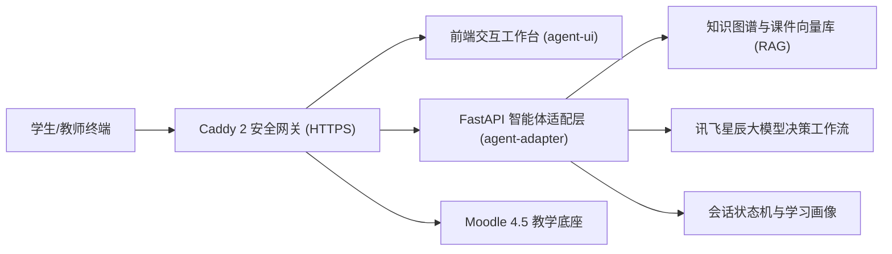

# 《电力系统储能技术》课程 AI Agent 平台使用手册

> **平台版本**：v2.0 (EnergyGraph-AI)  
> **线上访问地址**：[https://energygraph.icu](https://energygraph.icu) 或 [https://energygraph.icu/agent/](https://energygraph.icu/agent/)  
> **适用对象**：修读《电力系统储能技术》课程的学生、授课教师、教学管理与助教团队。

---

## 目录

1. [系统概述与核心定位](#1-系统概述与核心定位)
2. [快速访问与账号体系](#2-快速访问与账号体系)
   - [2.1 平台入口与网络要求](#21-平台入口与网络要求)
   - [2.2 用户注册与即时免密激活](#22-用户注册与即时免密激活)
   - [2.3 平台内置演示账号与角色切换](#23-平台内置演示账号与角色切换)
3. [学生端核心功能操作指南](#3-学生端核心功能操作指南)
   - [3.1 学习空间首页与进度总览](#31-学习空间首页与进度总览)
   - [3.2 课程资源库与沉浸式课件阅读器](#32-课程资源库与沉浸式课件阅读器)
   - [3.3 任务中心与在线随堂测验](#33-任务中心与在线随堂测验)
   - [3.4 课程思维导图（知识关联网络）](#34-课程思维导图知识关联网络)
   - [3.5 个人学情画像与多维能力分析](#35-个人学情画像与多维能力分析)
   - [3.6 AI 课程助教交互中心（核心多工作流）](#36-ai-课程助教交互中心核心多工作流)
4. [教师端教学管理操作指南](#4-教师端教学管理操作指南)
   - [4.1 班级学情大盘与知识点掌握度透视](#41-班级学情大盘与知识点掌握度透视)
   - [4.2 教师智能工作台（AI 辅助出题与组卷）](#42-教师智能工作台ai-辅助出题与组卷)
   - [4.3 作业发布与 AI 辅助批改](#43-作业发布与-ai-辅助批改)
5. [特色技术与交互亮点说明](#5-特色技术与交互亮点说明)
6. [常见问题解答 (FAQ)](#6-常见问题解答-faq)

---

## 1. 系统概述与核心定位

《电力系统储能技术》课程 AI Agent 平台（EnergyGraph-AI）是专为高校电气工程及新能源相关专业打造的**下一代智能化课程教学与自主学习系统**。

平台深度融合了 **Moodle 教学基座**、**讯飞星辰大模型 Workflow 引擎**、**教材课件切片检索（RAG）** 与 **全拓扑课程知识图谱**，提供覆盖“导学-阅读-答疑-测验-诊断-演练-实训-批改”的全流程闭环教学体验。



---

## 2. 快速访问与账号体系

### 2.1 平台入口与网络要求
- **全站入口**：直接在浏览器输入 **[https://energygraph.icu](https://energygraph.icu)**（会自动安全重定向至课程工作台）
- **课程直达链接**：[https://energygraph.icu/agent/](https://energygraph.icu/agent/)
- **网络适配**：支持 PC 电脑端（推荐使用 Chrome、Edge、Safari、Firefox）及平板设备，全站启用 HTTPS 安全传输。

### 2.2 用户注册与即时免密激活
平台支持全开放式学生自助注册：
1. 访问注册页面：[https://energygraph.icu/login/signup.php](https://energygraph.icu/login/signup.php)
2. 填写 **用户名**、**密码**（需包含大小写字母与数字）、**邮箱**、**姓名**。
3. 点击 **“创建新账号”**。
4. **免等待即刻生效**：系统已内置秒级自动激活与自动选课机制，提交后**无需等待邮件验证**，系统会自动完成激活并直接登入《电力系统储能技术》课程空间。

### 2.3 平台内置演示账号与角色切换
如需快速评审或体验不同角色功能，可直接使用以下内置账号登录：

| 角色类型 | 用户名 (Username) | 初始密码 (Password) | 适用场景与权限说明 |
| :--- | :--- | :--- | :--- |
| **学生视角** | `student` | `Moodle2026!` | 课件阅读、做题自测、AI 助教问答、学情诊断、思维导图 |
| **教师视角** | `teacher` | `Moodle2026!` | 班级学情监控、AI 辅助出题、试卷组卷、作业批改大盘 |
| **管理员视角** | `admin` | `Moodle2026!` | 全局服务监控、大模型链路配置、系统运维与日志审计 |

> [!TIP]
> 在前端页面右上角点击用户头像胶囊，也可以使用**角色切换器**快速在“学生/教师/管理员”视角之间无缝切换预览。

---

## 3. 学生端核心功能操作指南

### 3.1 学习空间首页与进度总览
进入平台后，默认展示 **课程首页（学习空间）**：
- **核心数据看板**：实时汇总展示当前已修学时、完成作业数、测验均分及 AI 答疑互动次数。
- **章节学习进度**：直观展示全课程 6 大章节、20 份课件的整体完成百分比进度条。
- **待办任务清单**：快捷列出近期需要完成的单元作业、随堂测验与考点强化任务，点击可直达答题。

---

### 3.2 课程资源库与沉浸式课件阅读器
点击左侧菜单 **“课程资源”**，可查阅本课程全量教材课件：

1. **章节目录导航**：
   - 第 1 章：电力系统储能技术概述（1.1-1.3）
   - 第 2 章：储能技术在电力系统中的应用（2.1-2.3）
   - 第 3 章：电化学与抽水蓄能系统原理（3.1-3.5）
   - 第 4 章：储能系统规划与配置计算（4.1-4.3）
   - 第 5 章：储能接入与运行控制（5.1-5.4）
   - 第 6 章：储能性能检测与综合评估（6.1-6.2）
2. **沉浸式课件阅读器**：
   - 点击任一课件可直接打开内置高清阅读器，支持全屏、缩放、缩略图导航与页面任意跳转，秒级渲染无卡顿。
   - 支持课件原件一键下载至本地复习。
3. **与 AI 助教的课件溯源联动**：
   - 在 AI 助教的学术答疑或思维导图考点抽屉中，点击任意附带的 **课件来源徽章**（如 `[课件 3.4 第 12 页 ↗]`），阅读器将在 **16ms 内极速唤起并自动定位至对应页码**，实现讲义与解答的无缝对照。

---

### 3.3 任务中心与在线随堂测验
点击左侧菜单 **“任务中心”**：
- **作业与测验列表**：清晰查看各章节课后作业、随堂自测试卷及其截止时间、总分值与完成状态。
- **在线答题交互**：
  - 支持单选题、多选题、判断题与主观计算题作答。
  - 答题后即刻提交，系统自动判分并给出标准答案与**详细解题步骤解析**。
  - 自动将错题收录进学生个人薄弱考点知识库，供后续 AI 学情诊断使用。

---

### 3.4 课程思维导图（知识关联网络）
点击左侧菜单 **“思维导图”**，可浏览课程全景知识网络图谱：

- **结构化拓扑排布**：
  - **大球节点（深色）**：代表 6 大核心章节枢纽。
  - **小球节点（浅色）**：代表 20+ 个细分专业知识考点。
  - **虚线连接线**：清晰标明知识点之间的**先修依赖关系**（如：“3.4 储能变流器拓扑” 是 “5.1 储能系统接入” 的前置基础）。
- **静态稳定排布**：已去除晃动与物理漂移，画面静止稳定，便于沉浸式梳理知识脉络。
- **考点详情抽屉**：点击任意节点，右侧即时展开考点提要、先修知识、对应教材 PDF 及精确页码。
- **一键深度探究**：在右侧抽屉点击 **“向课程助教提问”**，助教会自动针对该考点进行系统化拆解。

---

### 3.5 个人学情画像与多维能力分析
点击左侧菜单 **“班级学情与成绩”**（或顶部个人头像）：
- **综合掌握度雷达图**：从“原理掌握”、“规划配置”、“运行控制”、“系统检测”等 6 大维度评估学生能力分布。
- **考点掌握度排名**：清晰标注学生的优势知识点与高频薄弱考点（红黄色标识）。
- **AI 针对性复习路径**：系统根据做题记录，自动推荐需要重点重温的课件与拓展习题。

---

### 3.6 AI 课程助教交互中心（核心多工作流）
点击左侧菜单 **“课程助教”**，进入智能多轮对话工作台。助教支持以下 5 大核心工作流模式：

```
[模式选择]
   ├── 1. 自由专业答疑 (基于 20 份 PDF 的精准 RAG 知识检索与学术公式排版)
   ├── 2. 学情深度诊断 (前端做题数据全量直传，毫秒级定位知识断层与薄弱项)
   ├── 3. 智能出题与自测 (单选题自动生成，选项卡片一键点击，智能批改解析)
   ├── 4. 储能情景演练 (多角色切换：电站运维工程师 / 主讲教师实训模拟)
   └── 5. 课件划词溯源 (带精确页码的课件徽章，点击 16ms 直达原件页面)
```

#### ① 自由专业答疑与公式排版
- 支持复杂专业问题解答（如“磷酸铁锂与钠离子电池在电网调峰中的经济性对比”、“储能下垂控制一次调频模型”）。
- **LaTeX 数学公式实时排版**：全面支持复杂嵌套学术公式（如 $SOC = SOC_0 - \frac{\int_{0}^{t} I(\tau) d\tau}{Q_{\text{N}}}$、$\eta = \frac{E_{\text{out}}}{E_{\text{in}}} \times 100\%$、$L = L_0 (1 - k N^{0.5})$）。
- **深度思考折叠展示**：支持 DeepSeek-R1 风格的思维链（Reasoning Process）折叠与展开。
- **课件来源徽章溯源**：回答底部附带权威课件引用徽章（如 `[课件 3.4 第 12 页]`），点击即刻弹出课件阅读器跳转至对应页。

#### ② 学情深度诊断（极速工作流）
- 点击输入框上方的快捷提示词 **“帮我做一下学情诊断”** 或 **“分析我的薄弱知识点”**。
- 助教将在 **0.8 秒内** 结合您做过的全部测验与作业记录，结构化输出：
  1. 综合掌握度评估与当前能力水平；
  2. 核心薄弱知识考点定位；
  3. 先修依赖断层分析；
  4. 推荐复习课件篇目与针对性提分建议。

#### ③ 智能出题与交互批改
- 发送 **“给我出一道第3章的考题”** 或点击快捷动作 **“考点自测”**。
- 助教会生成包含工程情景题干的单选题，并在对话流中渲染为**可交互的选项卡片（A / B / C / D）**。
- **极简作答体验**：支持直接鼠标点击卡片选项、按下键盘快捷键 **`A` / `B` / `C` / `D`**，或自然语言输入 `我选B`，助教即刻进行智能批改判分并给出深度原理解析与踩分点说明。

#### ④ 储能工程情景演练（实训角色扮演）
- 发送 **“开启情景演练”** 或点击 **“师傅情景演练” / “名师情景演练”**。
- 助教将切换为 **“储能电站资深运维工程师”** 或 **“课程主讲名师”** 角色，设定真实工况（如“某 100MW/200MWh 储能电站集装箱电池温升过高且绝缘阻抗告警”），引导学生一步步排查故障原因并制定控制策略。
- 演练过程中随时输入 **“退出演练”** 即可一键恢复为标准助教模式。

#### ⑤ 划词追问与溯源推导
- 在助教回答或课件中选中文本段落，即刻浮现快捷工具条：
  - **引用追问**：将选中文本作为特定上下文向助教发起定向提问；
  - **深入推导**：针对选中的公式定理请求详细数学推导过程；
  - **概念辨析**：针对易混淆概念（如“功率型储能 vs 能量型储能”）请求对比辨析。

---

## 4. 教师端教学管理操作指南

以教师身份（账号 `teacher`）登录后，可使用专属的教学管理功能：

### 4.1 班级学情大盘与薄弱考点监控
- **班级整体及格率与均分**：实时掌握选课班级的作业提交率、测验平均成绩与活跃度分布。
- **班级薄弱知识点排行榜**：汇总统计全班学生在各考点上的平均错误率（如“4.2 电化学储能规划”错误率 42%），辅助教师在课堂上有针对性地重点串讲。
- **学生个体档案穿透**：可点击任意学生姓名，查看其独立的做题历史轨迹与 AI 诊断画像。

### 4.2 教师智能工作台（AI 辅助出题与组卷）
点击左侧菜单 **“教师工作台”**：
- **AI 智能生成试题**：选择目标章节、知识点和难度等级，由 AI 自动生成符合教学大纲的选择题、判断题与简答计算题草稿。
- **题目审查与一键入库**：教师可在线微调题干与选项分值，一键保存至课程公共题库。
- **智能组卷与作业派发**：勾选试题一键组装为单元作业或阶段测试卷，即时同步发布到学生端任务中心。

### 4.3 作业发布与 AI 辅助批改
- 在作业提交列表中，系统会自动调用大模型比对标准答案与踩分点，给出客观题自动打分与主观题初步评语建议。
- 教师可直接确认或一键修正评分，评语即时同步至 Moodle 成绩册与学生端。

---

## 5. 特色技术与交互亮点说明

| 核心特性模块 | 技术实现原理 | 给师生带来的核心价值 |
| :--- | :--- | :--- |
| **极速学情诊断** | 前端全量做题元数据结构化直传 + 轻量收敛检索 | 0.8s 极速响应，彻底消除模型脱离实际瞎编乱造，精准定位薄弱考点与知识断层 |
| **学术级公式渲染引擎** | 深度栈平衡扫描器 + 本地 KaTeX 离线双重保障 | 复杂微积分、多重嵌套括号、单字母变量学术公式 100% 优雅排版，无渲染乱码 |
| **确定性知识思维导图** | 静态放射状星形聚类几何拓扑算法 | 彻底取消小球晃动与物理漂移，全景 6 大章节与 20+ 知识拓扑一目了然 |
| **16ms 课件极速穿透** | 全局事件总线 + 虚拟切片快速渲染器 | 从助教回答或思维导图一键直跳课件对应页码，沉浸式学习体验不中断 |
| **企业级安全双重隔离** | FastAPI 中间件 + Moodle RBAC 角色权限鉴权 | 学生端与教师管理端严格边界隔离，防止越权改分或题库泄露，保障考核公正 |

---

## 6. 常见问题解答 (FAQ)

### Q1：为什么我注册账号后没有在 QQ 邮箱里收到激活邮件？
**答**：平台已全面启用 **“注册即自动激活”** 机制。当您在注册页面点击“创建新账号”后，系统已在后台瞬间完成账号激活并自动为您分配了《电力系统储能技术》课程权限。您**无需在邮箱中点击确认链接**，直接在登录页输入刚注册的账号密码即可登录。

### Q2：如果在登录页面提示“登录无效，请重试”怎么办？
**答**：
1. 请确认用户名大小写是否正确（如 `student`、`teacher` 等）。
2. Moodle 系统密码区分大小写，请检查 CapsLock 大写锁定键。
3. 若忘记密码，可联系课程管理员重置，或在登录页面点击“忘记了密码？”通过注册邮箱找回。

### Q3：AI 助教回答中的数学公式显示不正常怎么办？
**答**：系统已集成 KaTeX 数学公式渲染库并配置了本地离线资源。如果偶尔遇到显示不完整，请尝试在浏览器中按快捷键 **`Ctrl + F5`（Windows）** 或 **`Cmd + Shift + R`（Mac）** 进行强制刷新以清理旧缓存。

### Q4：思维导图里的小球可以拖动吗？
**答**：可以。用鼠标左键按住任意小球可将其拖动到任意位置进行个性化摆放，小球会稳定停留在拖放处；使用鼠标滚轮可整体缩放画布，按住空白处拖拽可平移视角，点击右上角“重置视角”可恢复初始状态。

### Q5：手机或平板可以使用本平台吗？
**答**：可以。系统全面采用了响应式前端布局，在手机浏览器或 iPad/平板电脑上访问均能良好适配，建议横屏浏览思维导图与课件阅读器以获得最佳阅读体验。

---

*如在使用过程中遇到任何其他技术疑问或教学建议，欢迎在平台“通知与讨论”板块发帖，或联系课程教学支持团队（邮箱：`registrar_off@qq.com`）。*
