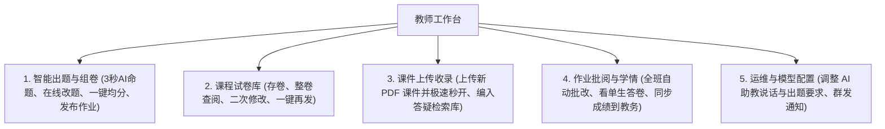
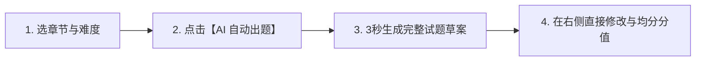
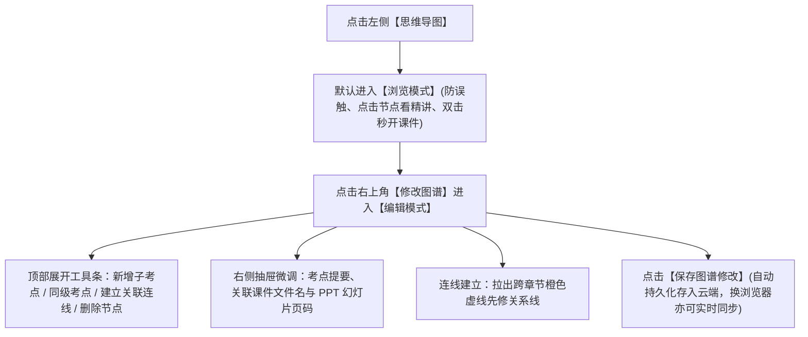

# 《电力系统储能技术》课程平台教师使用指南

欢迎各位授课教师使用《电力系统储能技术》课程教学与学习平台。本指南专为非计算机专业的任课老师编写，全部采用日常教学的大白话，没有复杂的计算机技术术语。

通过本平台，老师可以轻松实现：
- **智能出题**：选好章节和难度，AI 自动根据教学课件生成一套带选项、答案、详细解题步骤和讲义页码的作业题；
- **灵活改题与一键凑满分**：直接在线修改题干与答案；
- **布置作业**：发布后自动推送至全班学生端，并在讨论区置顶发布通知；
- **批量判分与同步教务**：系统瞬间自动批改客观题并给出针对性评语，一键将成绩写入学校教务成绩册；
- **全班学情薄弱点监控**：直观查看哪一道题全班做错的人最多，精准指导课堂重难点精讲；
- **试卷库复用**：将出好的整套试卷存入试卷库，后续学期一键直接下发；
- **课件极速阅读与无缝串讲**：20 份高清讲义瞬间秒开，左侧大纲缩略图即点即切，支持双击图谱考点秒级定位至对应幻灯片；
- **自主编辑与定制知识图谱（Mind-Elixir 引擎）**：支持全景与章节平滑切换、浏览与编辑双重门禁、自由增删知识点、建立橙色虚线先修依赖连线，并支持导出标准数据；
- **多模式 AI 教学辅助**：随堂单题快测、多题连续自适应学情诊断、电站站长工程排故演练与在线定制备课规则。

---

## 目录

1. [如何登录教师账号](#1-如何登录教师账号)
   - [1.1 平台访问地址](#11-平台访问地址)
   - [1.2 推荐使用的浏览器](#12-推荐使用的浏览器)
   - [1.3 教师登录账号与身份标识](#13-教师登录账号与身份标识)
2. [教师核心功能与工作台总览](#2-教师核心功能与工作台总览)
3. [如何让 AI 帮您快速出一套作业题？（3 秒出一套考题）](#3-如何让-ai-帮您快速出一套作业题3-秒出一套考题)
   - [3.1 选章节、选难度与设置题量](#31-选章节选难度与设置题量)
   - [3.2 智能生成的题目包含哪些内容？](#32-智能生成的题目包含哪些内容)
4. [如何微调题目内容、修改答案与调整分数？](#4-如何微调题目内容修改答案与调整分数)
   - [4.1 修改题干、选项与解析](#41-修改题干选项与解析)
   - [4.2 更改正确答案](#42-更改正确答案)
   - [4.3 手动调整单题分数与“一键平分满分100分”](#43-手动调整单题分数与一键平分满分100分)
   - [4.4 增删试题与手动加题](#44-增删试题与手动加题)
5. [如何预览试卷与答题卡，并把作业正式发布给全班？](#5-如何预览试卷与答题卡并把作业正式发布给全班)
   - [5.1 预览试卷（发布前看一眼答题卡）](#51-预览试卷发布前看一眼答题卡)
   - [5.2 确认发布作业至全班（自动推送与置顶公告）](#52-确认发布作业至全班自动推送与置顶公告)
6. [如何将出好的试卷存入试卷库留待后续使用？](#6-如何将出好的试卷存入试卷库留待后续使用)
   - [6.1 保存试卷到试卷库](#61-保存试卷到试卷库)
   - [6.2 在试卷库中查阅、重新编辑或一键再次下发](#62-在试卷库中查阅重新编辑或一键再次下发)
7. [如何上传与管理课程 PDF 课件？（含极速阅读与缩略图秒切体验）](#7-如何上传与管理课程-pdf-课件含极速阅读与缩略图秒切体验)
   - [7.1 上传新 PDF 课件收录入答疑库](#71-上传新-pdf-课件收录入答疑库)
   - [7.2 高清课件极速阅读与幻灯片秒级切换](#72-高清课件极速阅读与幻灯片秒级切换)
8. [如何批量批改作业并一键同步到教务成绩册？](#8-如何批量批改作业并一键同步到教务成绩册)
   - [8.1 查看全班提交进度概况](#81-查看全班提交进度概况)
   - [8.2 执行全班作业批量智能批改](#82-执行全班作业批量智能批改)
   - [8.3 查阅单个学生的答卷详情与失分归因](#83-查阅单个学生的答卷详情与失分归因)
   - [8.4 一键同步成绩至 Moodle 官方教务成绩册](#84-一键同步成绩至-moodle-官方教务成绩册)
9. [如何查看全班哪个章节和考点大家最容易做错？（学情指标与透明计算规则）](#9-如何查看全班哪个章节和考点大家最容易做错学情指标与透明计算规则)
   - [9.1 班级学情大盘核心指标与透明计算规则](#91-班级学情大盘核心指标与透明计算规则)
   - [9.2 各章节掌握度预警看板与六维雷达图（指导课堂精讲）](#92-各章节掌握度预警看板与六维雷达图指导课堂精讲)
10. [如何快速查询某一个学生的成绩与作答详情？](#10-如何快速查询某一个学生的成绩与作答详情)
    - [10.1 分数等级过滤筛选](#101-分数等级过滤筛选)
    - [10.2 姓名与学号模糊搜索](#102-姓名与学号模糊搜索)
11. [老师备课如何使用 24 小时 AI 助教与多模式教学？](#11-老师备课如何使用-24-小时-ai-助教与多模式教学)
    - [11.1 用 AI 助教验证公式推导与备课疑难](#111-用-ai-助教验证公式推导与备课疑难)
    - [11.2 区分两大随堂测评职能：单题快测 vs 连续学情诊断](#112-区分两大随堂测评职能单题快测-vs-连续学情诊断)
    - [11.3 虚拟储能电站站长情景演练（工程排故角色扮演）](#113-虚拟储能电站站长情景演练工程排故角色扮演)
    - [11.4 在线调整 AI 助教在备课与出题时的说话规范](#114-在线调整-ai-助教在备课与出题时的说话规范)
12. [如何使用与自主编辑定制课程思维导图与拓扑网络？（云端实时同步）](#12-如何使用与自主编辑定制课程思维导图与拓扑网络云端实时同步)
    - [12.1 基于 Mind-Elixir 开源思维导图引擎的全新架构](#121-基于-mind-elixir-开源思维导图引擎的全新架构)
    - [12.2 全景大盘与 1~6 章节独立视角平滑切换（消除白屏）](#122-全景大盘与-16-章节独立视角平滑切换消除白屏)
    - [12.3 双重模式门禁管控：浏览态防误触 vs 编辑态自由定制](#123-双重模式门禁管控浏览态防误触-vs-编辑态自由定制)
    - [12.4 自由增删考点与核心骨架防删安全保护机制](#124-自由增删考点与核心骨架防删安全保护机制)
    - [12.5 编辑考点信息与课件 PPT 幻灯片页码精准关联](#125-编辑考点信息与课件-ppt-幻灯片页码精准关联)
    - [12.6 建立跨章节先修依赖关系线（鲜明橙色虚线）](#126-建立跨章节先修依赖关系线鲜明橙色虚线)
    - [12.7 保存修改、云端跨设备同步、一键恢复默认图谱与导出标准 JSON](#127-保存修改云端跨设备同步一键恢复默认图谱与导出标准-json)
13. [如何发布教学通知与向全班群发提醒？](#13-如何发布教学通知与向全班群发提醒)
    - [13.1 讨论区发布课程公告](#131-讨论区发布课程公告)
    - [13.2 后台一键向全班群发催交作业广播通知](#132-后台一键向全班群发催交作业广播通知)
14. [教师常见问题解答 (FAQ)](#14-教师常见问题解答-faq)

---

## 1. 如何登录教师账号

### 1.1 平台访问地址
在电脑浏览器的地址栏输入以下网址打开平台：
- **访问网址**：`https://energygraph.icu` 或 `https://energygraph.icu/agent/`

### 1.2 推荐使用的浏览器
为了获得最流畅的教学操作体验，建议使用以下浏览器：
- 谷歌浏览器（Google Chrome，强烈推荐）
- 微软 Edge 浏览器
- 苹果 Safari 浏览器
- 360安全浏览器 / QQ浏览器（请开启“极速模式”）

### 1.3 教师登录账号与身份标识
在登录窗口输入预设的教师账号即可直接进入教学工作台：
- **用户名**：`teacher`
- **密码**：`Moodle2026!`（注意：首字母 M 为大写，末尾带半角感叹号）

---

## 2. 教师核心功能与工作台总览

登录教师账号后，点击左侧菜单栏的 **“教师工作台”**，即可进入教学管理中心。工作台顶部包含以下五个子功能面板：

---

## 3. 如何让 AI 帮您快速出一套作业题？（3 秒出一套考题）

平时老师备课出题往往需要翻阅课本和课件，耗费大量时间。在平台上，AI 可以根据《电力系统储能技术》课程标准大纲，在 3 秒内为您自动生成专业试题。

### 3.1 选章节、选难度与设置题量
1. 点击左侧菜单栏的 **“教师工作台”**，页面默认停留在 **“智能出题与组卷”** 面板；
2. 在左侧的参数配置区域进行简单选择：
   - **章节范围**：下拉选择要考查的章节：
     - `第1章 储能系统概述与发展`
     - `第2章 电力系统运行特性与储能技术应用`
     - `第3章 储能变流器拓扑与并网控制`
     - `第4章 电力储能系统容量规划与经济性评估 (LCOS)`
     - `第5章 储能系统接入与电网调频调峰控制`
     - `第6章 储能系统性能检测与综合评估`
   - **试卷难度**：
     - `基础认知`：适合课前预习检测，考查基本定义与工作原理；
     - `进阶应用`：适合随堂测验，考查变流器拓扑、控制公式与并网计算；
     - `综合分析`：适合阶段大作业，考查弱电网适应性、储能电站容量配置等实际工程案例；
   - **题目数量**：选择本次生成的题量（支持 1 题、3 题或 5 题）；
   - **题目类型**：选择 `单选题`、`多选题` 或 `综合判断题`；
   - **作业标签**：选择 `阶段测验`、`课程作业`、`随堂自测` 或 `大作业`；
   - **作业标题**：系统会自动给出一个建议标题（如“第3章 储能变流器拓扑与并网控制【进阶应用】测验”），老师也可以自行修改；
   - **截止日期**：设置学生最晚交卷时间；
3. 点击绿色的 **`AI 自动出题`** 按钮；
4. 等待 2 到 3 秒钟，右侧编辑区会立刻展示生成的整套考题。

### 3.2 智能生成的题目包含哪些内容？
每道生成的试题均包含完整的教学要素：
- **专业题干**：紧扣课程大纲与工程实际；
- **4 个互斥选项**：A、B、C、D 四个选项逻辑严密，无歧义；
- **标准答案**：自动标出正确选项；
- **名师深度解析**：详细列出解题步骤、原理分析与考点混淆归因；
- **课件出处页码**：自动注明该题出自哪一份 PDF 课件的第几页（例如 `第3章 储能变流器拓扑与并网控制.pdf 第 11 页`）。

---

## 4. 如何微调题目内容、修改答案与调整分数？

AI 生成的题目仅作为老师的初稿，老师拥有 100% 的终审与修改权力：

### 4.1 修改题干、选项与解析
- **修改题干**：直接用鼠标点击题干文本框，可以随意打字补充工程案例或修改文字表述；
- **修改选项**：直接点击 A、B、C、D 选项后面的输入框修改选项文字；
- **修改题目解析**：在考点解析输入框内补充您希望学生在做完后看到的重点讲解。

### 4.2 更改正确答案
- 点击 A、B、C、D 选项前面的小圆圈，即可随时将标准答案指定为您需要的选项。

### 4.3 手动调整单题分数与“一键平分满分100分”
- **手动改单题分数**：在题目卡片右上角的分数框中直接输入分值（例如把某道重点题目设为 40 分，其余各 30 分）；
- **一键平分满分 100 分（非常实用）**：
  - 如果试卷包含多道题目，老师无需手动心算各题分值；
  - 点击试卷上方的 **`一键平分满分100分`** 按钮；
  - 系统会自动将所有题目的分数均匀分配并自动凑整，确保整张试卷总分正好是 100 分。

### 4.4 增删试题与手动加题
- **删除题目**：点击题目卡片右上角的 **`删除本题`**，可以移除不符合要求的试题；
- **手动添加题目**：点击底部的 **`+ 继续添加一道题目`**，可以随时手动加题，自己填写题干与选项。

---

## 5. 如何预览试卷与答题卡，并把作业正式发布给全班？

### 5.1 预览试卷（发布前看一眼答题卡）
在正式把作业发给学生之前，老师可以先看一眼学生看到的答题卡长什么样：
1. 点击试卷上方的 **`预览试卷`** 按钮；
2. 屏幕上会弹出一个答题卡预览窗口（和学生打开做作业时的界面一模一样）；
3. 老师可以在里面翻看每一道题的排版、选项和答案解析，确认没有问题；
4. 看完后点击右上角关闭预览窗口即可。

### 5.2 确认发布作业至全班（自动推送与置顶公告）
1. 检查作业标题、截止时间和题目无误后，点击绿色大按钮 **`确认发布作业至全班`**；
2. 点击后，系统会自动完成两件事：
   - **推送至学生端**：全班所有选课学生的“任务中心”列表首位会立刻出现这份作业，状态标记为“待完成”；
   - **自动发布置顶通知**：系统的“通知与讨论”板块会自动发布一条《新作业发布通知》，公告内容包含作业名称、总分、题量与截止时间，提醒全班同学按时完成。

---

## 6. 如何将出好的试卷存入试卷库留待后续使用？

如果您组配出了一套高质量的经典试卷，希望留作期末复习或下学期教学使用：

### 6.1 保存试卷到试卷库
1. 在出题页面组卷完成后，点击试卷上方的 **`保存为试卷组`** 按钮；
2. 系统会提示试卷已成功入库。

### 6.2 在试卷库中查阅、重新编辑或一键再次下发
点击工作台顶部的 **“课程试卷库”** 选项卡，在试卷库列表中可以看到所有保存过的试卷组：
- **`查看试卷`**：点击弹出全屏整卷预览，完整查看试卷全部题目、选项、答案与解析；
- **`载入出题台`**：点击将该试卷重新调入出题工作台，老师可以更换部分题目或调整分值后重新组卷；
- **`一键发布`**：新学期开课时，无需重复出题，直接点击即可一键下发给当前新班级；
- **`删除`**：清理废弃的试卷。

---

## 7. 如何上传与管理课程 PDF 课件？（含极速阅读与缩略图秒切体验）

平台收录了 6 大章节共 20 份官方高清课件。如果后续教学需要补充新讲义：

### 7.1 上传新 PDF 课件收录入答疑库
1. 进入 **“教师工作台” -> “课件上传收录”** 面板；
2. 选择该课件所属的章节；
3. 点击或拖拽将本地的 PDF 文件上传至虚线框区域；
4. 点击 **`上传并收录入资源包`**；
5. 上传成功后，新课件不仅会出现在“课程资源”列表中供学生阅读，还会自动编入 AI 助教的知识检索库中，学生提问时 AI 会自动引用该新课件。

### 7.2 高清课件极速阅读与幻灯片秒级切换
在左侧菜单栏点击 **“课程资源”**，老师可直接查阅已上架的各章讲义：
- **秒级打开**：阅读器全面升级了预加载与轻量级缓存技术，打开 PPT 课件告别漫长等待；
- **左侧缩略图即点即切**：左侧提供每一页幻灯片的缩略图列表与页码，用鼠标点击任意缩略图，右侧高清主画面会瞬间平滑切换，杜绝点击无反应或迟滞现象；
- **双向讲义联动**：在讲义阅读器内选中文字，可直接点击工具条向助教发起深度提问，也可以直接复制引用到备课笔记中。

---

## 8. 如何批量批改作业并一键同步到教务成绩册？

学生在手机或电脑端提交作业后，老师无需逐本翻阅纸质作业：

### 8.1 查看全班提交进度概况
进入 **“教师工作台” -> “作业批阅与学情”** 面板，顶部会实时显示当前全班的提交数据：
- **全班提交人数**：已提交人数 / 全班总人数；
- **待批改人数**：尚未完成判分的作业份数；
- **全班平均分**：已批改作业的平均得分；
- **批阅完成率**：当前批改进度百分比。

### 8.2 执行全班作业批量智能批改
- 点击 **`执行全班作业批量批改`** 按钮；
- 系统会自动比对标准答案，在瞬间完成全班所有单选、多选等客观题的判分，并结合学生的作答情况生成针对性的名师指导评语。

### 8.3 查阅单个学生的答卷详情与失分归因
在下方的学生提交列表中，找到指定学生，点击右侧的 **`查看答卷`**：
1. **成绩横幅**：显示该生实得分数、试卷满分与得分率；
2. **智能教师评语**：系统结合该生作答生成的鼓励性与诊断性评语；
3. **逐题正误对比**：
   - 完整展示 A/B/C/D 选项；
   - 标出 `[标准答案]`（绿底）；
   - 标出 `[您的选择]`（学生选对标绿底，选错标浅红底）；
   - 展示详细的失分归因与名师解析；
   - 点击 **`查阅关联讲义 (点击跳转)`** 可在 16 毫秒内瞬间调出对应 PDF 课件的指定页码。

---

## 9. 如何查看全班哪个章节和考点大家最容易做错？（学情指标与透明计算规则）

为了让课堂教学更有针对性，平台提供了班级维度的考点掌握度大盘，且所有核心指标全部公开透明：

### 9.1 班级学情大盘核心指标与透明计算规则
点击左侧菜单栏的 **“班级学情与成绩”**，页面顶部展示四大班级核心指标。老师将鼠标悬停在卡片右上角的小问号上，即可查看透明的数学计算规则：
- **全班平均成绩**：已批改作业的平均得分，并在下方标明及格率（即得分 $\ge 60$ 分的学生比例）；
  - *计算规则*：已批改作业得分总和 / 已批改作业份数；
- **作业提交总览**：展示全班学生在全部作业中的提交覆盖情况；
  - *计算规则*：全班累计提交人次 / 累计应交人次，清晰区分班级整体完成率与单个作业的按时状态；
- **需关注考点**：全班失分较为集中的薄弱知识点数量；
  - *评定标准*：全班在该考点的平均掌握度低于 60% 且错题频次较高的知识考点，系统会自动提取出来供备课参考；
- **班级学情指数**：综合评价全班学情的健康等级（优秀/良好/中等/需关注）；
  - *综合权重*：作业提交进度（占 30%）+ 测验均分（占 50%）+ 课件学习进度（占 20%）。

---

## 10. 如何快速查询某一个学生的成绩与作答详情？

在“班级学情与成绩”页面下方的全班成绩花名册中：

### 10.1 分数等级过滤筛选
点击表格上方的筛选标签：
- **全部学生**：查看全班所有学生；
- **优秀生**（$\ge 90$ 分）；
- **良好生**（$75\sim 89$ 分）；
- **需关注生**（$< 75$ 分，重点关注平时需要课后辅导的学生）。

### 10.2 姓名与学号模糊搜索
- 在表格右上角的搜索框里输入学生的**真实姓名**（例如“张三”或“邹皓”）或**学号**；
- 表格会实时过滤出该生的课件学习进度、平时作业均分、期中测验成绩、综合折算分、个人主要薄弱点以及学情评级；
- 点击记录可调阅该生历次作业的做题答卷与错题清单。

---

## 11. 老师备课如何使用 24 小时 AI 助教与多模式教学？

除了管理班级，老师在日常备课时也可以充分利用平台的 AI 助教：

### 11.1 用 AI 助教验证公式推导与备课疑难
点击左侧菜单栏的 **“课程助教”**：
- **数学公式验证**：输入复杂的变流器控制方程或下垂控制算法，AI 助教会输出排版工整的 LaTeX 数学公式，方便老师复制到教案中；
- **工程案例参考**：让助教提供电网故障排查案例或综合规划例题；
- **课件溯源**：助教每次回答都会附带课件页码标签，点击可瞬间调出对应讲义。

### 11.2 区分两大随堂测评职能：单题快测 vs 连续学情诊断
平台将随堂自测与结构化学情诊断做了清晰的职能解耦：
1. **随堂出题测试（单题即时快问快测）**：
   - 场景：课堂讲解完某一知识点（如构网型控制）后，点击 `[ 随堂出题测试 ]`；
   - 表现：AI 针对当前知识点立即精准出一道单选题，展示交互式 A/B/C/D 选项卡；
   - 效果：学生或老师点击选项后，系统立即给出正误判定、解题步骤以及精准课件页码定位，适合课堂即时小测验；
2. **互动学情诊断（多章节连续自适应体检）**：
   - 场景：单元复习或阶段考核时，点击 `[ 进行学情诊断 ]`；
   - 表现：AI 开展连续自适应测评（连出 3 到 5 道跨章节综合题目），每作答一题，AI 即时流式点评概念混淆点；
   - 效果：作答完成后流式生成完整的四模块终局诊断大报告（知识掌握雷达分级、失分漏洞剖析、认知误区纠偏与靶向学习路径），全面体检学生学情。

### 11.3 虚拟储能电站站长情景演练（工程排故角色扮演）
点击助教顶部的 `[ 师傅情景演练 ]` 或 `[ 名师情景演练 ]`：
- AI 助教会化身为储能电站现场总工程师或资深名师；
- 模拟真实电站突发故障（如电池簇过温告警、变流器锁相环失步）；
- 老师可借此体验工程故障互动推演，并把案例直接作为工程实操教学素材。

### 11.4 在线调整 AI 助教在备课与出题时的说话规范
进入 **“教师工作台” -> “运维与模型配置”**，在“AI 说话与出题要求设置”区域：
- 切换到 **`教师备课工作要求`** 选项卡；
- 老师可以在输入框里直接打字提出要求（例如：“要求生成题目时必须结合最新的中国储能国家标准 GB/T 36547”）；
- 点击 **`保存规则配置`**，修改立即生效；
- 若修改后效果不理想，点击 **`恢复默认规则`** 即可一键还原为出厂预设。

---

## 12. 如何使用与自主编辑定制课程思维导图与拓扑网络？（云端实时同步）

为了帮助学生建立宏观系统工程思维，平台基于知名开源思维导图引擎 **Mind-Elixir** 重构了课程知识导图。老师不仅可以用它直观串讲 6 大章节脉络，还可以完全自主自由地修改和扩展知识图谱！

### 12.1 基于 Mind-Elixir 开源思维导图引擎的全新架构
- **系统架构**：基于轻量、高效的 Mind-Elixir 树状架构，整合了课程 6 大章节枢纽、全部核心知识考点，以及跨章节的先修依赖关系；
- **平滑流畅交互**：支持按住鼠标空白处平滑拖拽画布、滑动鼠标滚轮平滑缩放、点击节点选中高亮，操作跟电脑桌面脑图软件一样顺畅。

### 12.2 全景大盘
在思维导图界面的顶部正中央，提供了一个视角快速切换下拉框：
- **全景视图 (全课程)**：展示整门课程的顶层根节点《电力系统储能技术》以及 6 大章节的分支脉络；
- **第 1 章 储能系统概述与发展**；
- **第 2 章 电力系统应用**；
- **第 3 章 储能系统原理**；
- **第 4 章 规划配置**；
- **第 5 章 接入与控制**；
- **第 6 章 检测与评估**；
- **防白屏平滑算法**：切换时系统采用物理中心 Delta 算法，目标章节节点会自动平滑滑动至画布正中央并以高亮显示，绝无旧版切换时出现的画布移出视野或空白现象。

### 12.3 双重模式门禁管控：浏览态防误触 vs 编辑态自由定制
为了防止课堂演示时不小心误改或误删知识点，系统设立了严格的双模式门禁：
- **浏览模式（默认状态）**：
  - 右上角仅显示：`[ 修改图谱 ]` 与 `[ 向课程助教提问 ]`；
  - 增删节点等编辑工具条完全隐藏；
  - 键盘上的 Delete、Backspace、Tab、Enter 等键被系统安全拦截，不会破坏图谱；
  - **课堂串讲操作**：
    - 单击任意知识点节点：右侧抽屉立即滑出该考点的“核心概念与考点提要”、“前置基础考点”、“关联进阶考点”以及“知识图谱拓扑关联”；
    - 双击节点或点击抽屉中的 **`[ 打开对应PPT课件 (第 X 页) (点击跳转) ]`**：直接在界面中秒级调出该考点对应的官方 PDF 课件并定位至该幻灯片，方便随堂讲授。
- **编辑模式（定制状态）**：
  - 老师点击右上角的绿色按钮 **`[ 修改图谱 ]`**，即可开启编辑模式；
  - 顶部自动展开完整的编辑操作条，右上角按钮切换为：`[ 保存图谱修改 ]`、`[ 恢复默认图谱 ]`、`[ 退出编辑 ]`。

### 12.4 自由增删考点与核心骨架防删安全保护机制
在编辑模式下，老师可以根据自己的授课进度和教学设计扩展图谱：
- **新增子考点**：用鼠标选中某个章节或考点节点，点击顶部工具栏的 **`+ 新增子考点`**，该节点下方会立刻生成一个新考点，老师可直接修改其名称；
- **新增同级考点**：选中某个考点节点，点击 **`+ 新增同级考点`**，系统会在同级位置添加一个并列知识点；
- **删除冗余节点**：选中要删除的知识点，点击顶部工具栏的 **`删除节点`**，并在弹出的确认提示中点击确定即可删除该节点；
- **核心骨架防删保护机制**：
  - 课程根节点《电力系统储能技术》知识架构以及 6 个核心章节主干节点（`ch_1` 至 `ch_6`）是整门课程的基础骨架；
  - 如果老师误选中了这些骨架节点并点击删除，系统会立即拦截并弹出红色提示：`“课程主干根节点与核心章节枢纽禁止删除”`，确保教学纲要始终稳定可靠。

### 12.5 编辑考点信息与课件 PPT 幻灯片页码精准关联
在编辑模式下，点击选中的考点节点：
- 在右侧滑出的抽屉中，点击底部的 **`[ 编辑此节点信息与PPT关联 ]`** 按钮；
- 界面会弹出考点属性编辑窗口，老师可以设置：
  - **考点名称**：如“构网型变流器虚阻抗控制”；
  - **考点提要与重难点说明**：简明扼要写明该考点的考查要求；
  - **关联课件文件名**：下拉选择对应的 PDF 课件；
  - **课件 PPT 幻灯片页码**：输入该考点在 PPT 中对应的页码（如 `第 14 页`）；
- 点击保存后，图谱上该节点右侧会自动亮起绿色的 `PPT P.14` 徽标标签，学生或老师点击标签即可直达课件第 14 页。

### 12.6 建立跨章节先修依赖关系线（鲜明橙色虚线）
许多储能技术具有强烈的跨学科前置依赖（例如学第4章的储能规划前，必须先掌握第2章的电网调峰调频特性）：
1. 选中起始考点节点；
2. 点击顶部工具栏的 **`建立关联连线`** 按钮，按钮会高亮提示“请点击目标考点完成连线”；
3. 用鼠标点击目标考点节点；
4. 系统会弹出连线说明输入框，老师可输入关系名称（例如“机理定容”、“系统集成”、“定容依据”、“控制需求”等）；
5. 确认后，两个考点之间会拉出一条非常醒目的**橙色虚线**（带有关系标签文本与实心箭头），直观标明知识先修逻辑；
6. 在右侧抽屉中，还可以随时查看该考点涉及的所有拓扑关联，点击关联名称旁边的 `[解除]` 按钮即可拆除多余连线。

### 12.7 保存修改、云端跨设备同步、一键恢复默认图谱与导出标准 JSON
- **保存图谱修改（自动持久化存入云端）**：编辑完成后，点击右上角的 **`[ 保存图谱修改 ]`**，系统会将最新的知识图谱数据直接保存到云端服务器的持久化数据库中。老师无论更换电脑、切换不同浏览器（如从 Chrome 换到 Edge 或 Safari）、还是在课后多端备课，打开平台都会自动同步加载您最新修改的知识图谱，无需手动导出导入备份；
- **一键恢复默认图谱**：如果您在调整过程中连线混乱或误改较多，点击 **`[ 恢复默认图谱 ]`**，系统会瞬间一键重置为出厂预设的完整标准教学知识图谱，并同步清空云端覆盖数据；
- **退出编辑**：点击 **`[ 退出编辑 ]`**，系统会自动将最新成果同步至云端，工具条自动收起，右上角按键自动复原为 `[ 修改图谱 ]`，回归纯净的浏览态；
- **导出 JSON 数据**：点击顶部的 **`[ 导出JSON ]`** 按钮，系统会自动下载名为 `energygraph-mindmap-data.json` 的标准数据文件，方便老师在备课会、教研汇报中分享，或在其他班级中直接导入使用。

---

## 13. 如何发布教学通知与向全班群发提醒？

平台提供两种通知发布方式：
1. **讨论区发布课程公告**：
   - 点击左侧菜单栏的 **“通知与讨论”**；
   - 点击 **`发布新主题`**，选择公告标签（如“调课通知”、“答疑交流”），输入标题与正文发布；
   - 公告会展示在全班同学的讨论区列表顶部；
2. **后台一键群发作业催交提醒**：
   - 进入 **“教师工作台” -> “运维与模型配置”**；
   - 点击 **`发布系统通知`** 按钮；
   - 系统会自动向全班 42 名选课学生推送一条置顶的作业截止提醒通知。

---

## 14. 教师常见问题解答 (FAQ)

### Q1：AI 出的题目会不会超出教学大纲？
**答**：不会。平台的 AI 出题功能深度绑定了《电力系统储能技术》课程的 20 份官方课件和教学知识库，生成的所有考点、公式和案例均严格限制在课程范围内，并会自动标注课件出处页码。

### Q2：发布的作业截止时间到了之后，还能改动吗？
**答**：可以。老师进入工作台随时可以调整作业的截止时间。

### Q3：如果发现某道题的标准答案预设错了，怎么办？
**答**：老师在出题界面点击选项前面的圆圈即可随时更改正确答案。若作业已发布，在工作台修改后点击重新批改，系统会自动按新答案重新计算全班分数。

### Q4：客观题自动批改的准确率如何？
**答**：客观题（单选题、多选题、判断题）中，当学生选中的选项与标准答案一致即获得满分，多选题漏选按 50% 判分。

### Q5：老师自己修改了思维导图之后，如果换了浏览器或换了电脑还能看到吗？
**答**：能看到！平台全面支持云端多端同步。老师在图谱界面点击“保存图谱修改”后，修改的数据会实时上传并持久化存储在云端服务器数据库中。您换用任意浏览器、在办公室电脑或个人笔记本上登录教师账号，打开“思维导图”均会自动从云端拉取您最新的教学图谱成果；若需恢复大纲原貌，随时点击“恢复默认图谱”即可一键恢复系统标准大纲。

### Q6：遇到系统操作疑问，如何联系技术团队？
**答**：老师可直接发送邮件至课程教学技术支持邮箱：`registrar_off@qq.com`，技术团队将在 24 小时内为您协助处理。
